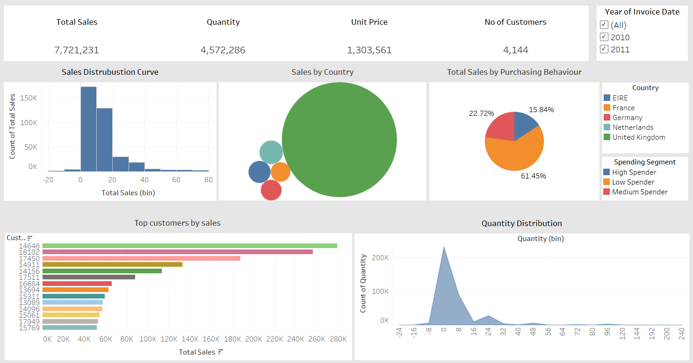
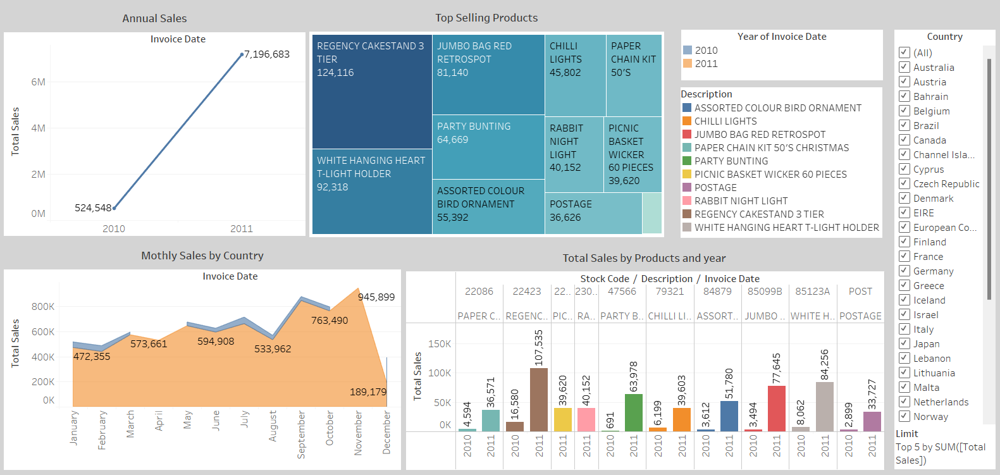

# CUSTOMER SEGMENTATION ANALYSIS FOR E-COMMERCE SALES

## PROJECT OVERVIEW
This project focuses on customer segmentation using Recency, Frequency, and Monetary (RFM) analysis. The goal is to segment customers based on their purchasing behavior and attributes in order to provide actionable insights for targeted marketing, customer retention, and product strategy. This project leverages SQL for data querying and analysis to identify key customer segments that businesses can focus on to improve their marketing and customer service strategies.


* RFM is a data modeling method used to analyze customer value. 
* It stands for Recency, Frequency, and Monetary which are the three metrics that describe the customers. 
* It is an indexing technique that uses past purchase behaviour to segment customers.
#### `Recency`
* Last Order Date
#### `Frequency`
* Count of Total Orders
#### `Monetary`
* Total Money Spend

## RFM Analysis
**1. Recency (R):**
Measures the number of days since the customer’s last purchase. Customers who made a purchase recently are more likely to engage in the future.
```
SELECT CustomerID, DATEDIFF(CURDATE(), MAX(InvoiceDate)) AS Recency
FROM customer_data
GROUP BY CustomerID;

```
**2. Frequency (F):**
Measures the total number of purchases made by a customer. Frequent buyers are often loyal customers.
```
SELECT CustomerID, COUNT(DISTINCT InvoiceNo) AS Frequency
FROM customer_data
GROUP BY CustomerID;
```

**3.Monetary (M):**
Measures the total amount of money a customer has spent. Customers who spend more are usually more valuable to the business.
```
SELECT CustomerID, SUM(Quantity * UnitPrice) AS Monetary
FROM customer_data
GROUP BY CustomerID;
```

## SQL Query for Customer Segmentation
```
WITH RFM AS (
    SELECT 
        CustomerID,
        DATEDIFF(CURDATE(), MAX(InvoiceDate)) AS Recency,
        COUNT(DISTINCT InvoiceNo) AS Frequency,
        SUM(Quantity * UnitPrice) AS Monetary
    FROM customer_data
    GROUP BY CustomerID
)

SELECT 
    CustomerID,
    Recency,
    Frequency,
    Monetary,
    CASE
        WHEN Recency <= 30 AND Frequency >= 5 THEN 'Active Customer'
        WHEN Frequency >= 10 THEN 'Loyal Customer'
        WHEN Recency > 180 THEN 'Churned Customer'
        WHEN Recency > 90 AND Recency <= 180 THEN 'At-Risk Customer'
        WHEN Recency <= 30 AND Frequency <= 2 THEN 'New Customer'
        WHEN Recency <= 30 AND Frequency BETWEEN 3 AND 5 THEN 'Potential Loyalist'
        ELSE 'Inactive Customer'
    END AS CustomerSegment
FROM RFM;
```

## Tableau Dashboard
* Sales Dashboard 1


* Sales Dashboard 2



# THANK YOU
